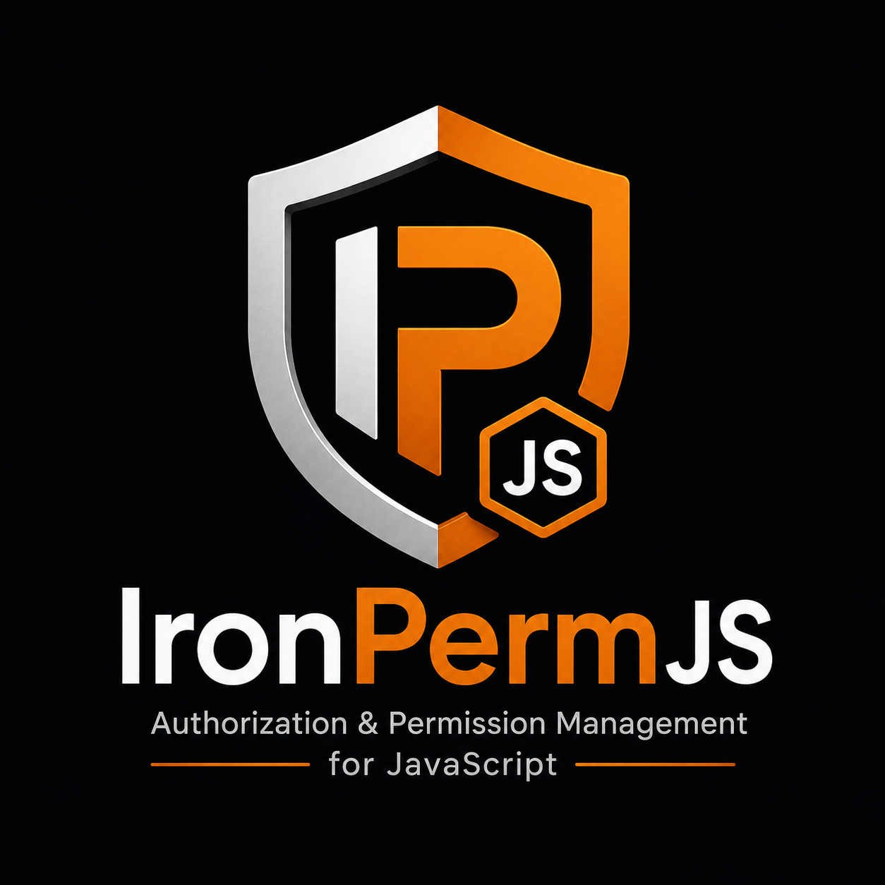

<p align="center">
  
</p>

# IronPermJS

[](https://github.com/BlackProgrammer-prog/permGuard/actions/workflows/ci.yml)
[](LICENSE)
[](package.json)

**See where authorization is defined, enforced, missing, and changing in a full-stack TypeScript application.**

IronPermJS is an open-source authorization toolkit built around [CASL](https://casl.js.org/). CASL makes permission decisions. IronPermJS adds explicit server and UI integrations, AST-based analysis, authorization coverage, an offline HTML dashboard, semantic diffs, and CI policy enforcement.

IronPermJS does not replace CASL, authentication, or your server-side security boundary.

## Why IronPermJS?

Authorization usually spreads across ability definitions, Route Handlers, Server Actions, React components, and API clients. Code review can miss a new endpoint with no authorization check, a UI/server permission mismatch, or a permission rule that is no longer used.

IronPermJS turns those scattered signals into one deterministic analysis model:

```text
TypeScript / TSX
      ↓
AST analyzer
      ↓
permissions · routes · server actions · API calls · checks · issues
      ↓
CLI · JSON · graph · offline HTML report · diff · CI
```

It currently understands:

- CASL `AbilityBuilder` definitions and common enforcement patterns
- Next.js App Router Route Handlers and Server Actions
- IronPermJS server, React, and Next.js helpers
- `fetch`, Axios, Axios instances, `ky`, and configured API wrappers
- missing boundary enforcement, unknown permission references, and probable unused rules
- client-to-route links, authorization graph construction, and boundary coverage
- baseline diffs and severity-based CI failures

Every heuristic finding has a confidence level. Coverage means “a recognized check was detected,” not “the policy is proven secure.”

## Requirements

- Node.js 20 or newer
- pnpm 10 for repository development
- TypeScript source for static analysis
- CASL as the authorization engine

## Quick start

> The source currently uses the `@ironpermjs` npm scope. Confirm that you own this scope—or rename it to an npm scope you own—before the first public release. See [Publishing](docs/publishing.md).

Install the CLI in the application you want to inspect:

```bash
pnpm add -D @ironpermjs/cli
```

Scan a Next.js project:

```bash
pnpm exec ironpermjs scan .
```

Create an offline report:

```bash
pnpm exec ironpermjs report . --output ironpermjs-report.html
```

Fail CI when a `HIGH` or `CRITICAL` issue is detected:

```bash
pnpm exec ironpermjs scan . --ci --fail-on HIGH
```

The analyzer does not execute application code and does not need application secrets.

## Define permissions with CASL

Your application owns users, sessions, resource loading, and policy definitions:

```ts
import { AbilityBuilder, createMongoAbility } from "@casl/ability";

interface User {
  id: string;
  role: "admin" | "editor";
}

export function defineAbilityFor(user: User) {
  const { can, cannot, build } = new AbilityBuilder(createMongoAbility);

  if (user.role === "admin") {
    can("manage", "all");
  }

  if (user.role === "editor") {
    can("read", "Product");
    can("update", "Product");
  }

  cannot("delete", "Product");

  return build();
}
```

IronPermJS deliberately leaves rule evaluation to CASL.

## Enforce on the server

Install only the integration you need:

```bash
pnpm add @casl/ability @ironpermjs/server
```

```ts
import { requireCan } from "@ironpermjs/server";

const ability = defineAbilityFor(user);

// Throws CASL's ForbiddenError when denied.
requireCan(ability, "update", "Product");
```

For conditional rules, authorize the concrete resource rather than only its subject name:

```ts
import { subject } from "@casl/ability";

const product = await products.findById(productId);
requireCan(ability, "update", subject("Product", product));
await products.update(productId, input);
```

Load and authorize before mutation. Never accept an ability, role, or permission list from the browser.

## Integrate with Next.js

```bash
pnpm add @casl/ability @ironpermjs/next
```

Create one application-owned resolver:

```ts
import { createNextAuthorization } from "@ironpermjs/next";
import { defineAbilityFor } from "./ability";
import { requireUser } from "./session";

export const { requireCan, withAuthorization } = createNextAuthorization(
  async () => defineAbilityFor(await requireUser()),
);
```

Protect a Route Handler explicitly:

```ts
import { withAuthorization } from "@/lib/authorization";

export const DELETE = withAuthorization(
  ["delete", "Product"],
  async (_request, { params }) => {
    const { id } = await params;
    await deleteProduct(id);
    return new Response(null, { status: 204 });
  },
);
```

Protect a Server Action:

```ts
"use server";

import { requireCan } from "@/lib/authorization";

export async function publishProduct(id: string) {
  await requireCan("publish", "Product");
  await products.publish(id);
}
```

The ability resolver runs per invocation. IronPermJS does not introduce hidden middleware or global authorization state.

## Render permission-aware React UI

```bash
pnpm add @casl/ability @ironpermjs/react react
```

```tsx
import { AbilityProvider, Can, useCan } from "@ironpermjs/react";

export function ProductActions({ ability }: { ability: AppAbility }) {
  return (
    <AbilityProvider value={ability}>
      <Can
        action="delete"
        subject="Product"
        fallback={<span>Deletion is not available</span>}
      >
        <DeleteButton />
      </Can>
    </AbilityProvider>
  );
}
```

`Can` and `useCan` improve UX only. The server must independently enforce every sensitive operation. Prefer a minimal permission snapshot when full server-side CASL rules contain sensitive conditions.

## API client discovery

IronPermJS recognizes direct and instance-based clients:

```ts
await fetch("/api/products/42", { method: "DELETE" });
await axios.delete("/api/products/42");

const api = axios.create({ baseURL: "/api" });
await api.patch("/products/42", input);

await ky.post("/api/products", { json: input });
```

Register an imported project-specific wrapper with a repeatable CLI option:

```bash
pnpm exec ironpermjs scan . \
  --client-module "@/lib/api-client" \
  --client-module "@acme/http"
```

Dynamic URLs are reported conservatively with lower confidence when the exact route cannot be proven.

## Commands

```bash
ironpermjs scan [root] [options]
ironpermjs graph [root] --output authorization-graph.json
ironpermjs report [root] --output ironpermjs-report.html
ironpermjs diff [root] --baseline previous-analysis.json
```

Useful scan options:

- `--json`: emit the full versioned analysis model
- `--output <file>`: write output instead of printing it
- `--tsconfig <file>`: select a non-default TypeScript config
- `--client-module <specifier>`: recognize an imported API wrapper
- `--ci --fail-on <severity>`: return exit code 3 when policy fails

See the complete [CLI reference](docs/cli-reference.md).

## Packages

| Package                | Responsibility                                   |
| ---------------------- | ------------------------------------------------ |
| `@ironpermjs/core`     | Framework-independent types and analysis model   |
| `@ironpermjs/server`   | CASL-based server enforcement and safe snapshots |
| `@ironpermjs/react`    | Analyzer-friendly React UI helpers               |
| `@ironpermjs/next`     | Explicit Next.js App Router integration          |
| `@ironpermjs/analyzer` | TypeScript AST parsing and detection passes      |
| `@ironpermjs/graph`    | Deterministic authorization graph construction   |
| `@ironpermjs/diff`     | Semantic analysis diff and CI policy             |
| `@ironpermjs/reporter` | Offline HTML and JSON rendering                  |
| `@ironpermjs/cli`      | Command-line orchestration                       |

Applications normally install `cli` for auditing and one or more runtime integrations. They do not need every package.

## Documentation

- [Getting started tutorial](docs/getting-started.md)
- [CLI reference](docs/cli-reference.md)
- [Public API reference](docs/api-reference.md)
- [Architecture](docs/architecture.md)
- [Security model](docs/security-model.md)
- [Publishing and trusted releases](docs/publishing.md)
- [Troubleshooting](docs/troubleshooting.md)
- [Roadmap and phase notes](docs/roadmap.md)

## Current limitations

Static analysis cannot prove runtime policy correctness. Dynamic imports, computed permission names, deeply abstracted handlers, framework magic, or generated source may reduce confidence or remain unresolved. Initial framework support focuses on the Next.js App Router. Role extraction is not yet populated in the high-level CLI result.

These are reported as analysis limits—not silently presented as security guarantees.

## Development

```bash
git clone https://github.com/BlackProgrammer-prog/IronPermJS.git
cd IronPermJS
corepack enable
pnpm install --frozen-lockfile
pnpm check
pnpm release:verify
```

`pnpm check` runs formatting validation, ESLint, strict TypeScript checking, 85+ tests, and all package builds. `pnpm release:verify` then creates and inspects the exact npm tarballs.

Read [CONTRIBUTING.md](CONTRIBUTING.md) before opening a pull request. Security reports should follow [SECURITY.md](SECURITY.md).

## License

MIT © IronPermJS contributors.
